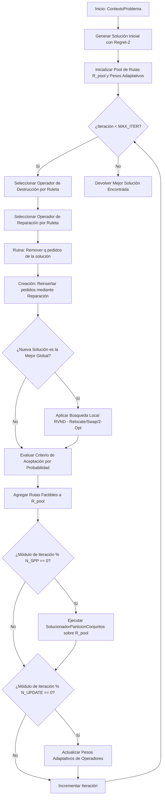

# Guía de Estudio y Explicación del Algoritmo ALNS - PaqRap

Este documento explica de manera detallada la arquitectura, estructura de código y funcionamiento interno del algoritmo **ALNS (Adaptive Large Neighborhood Search / Búsqueda Adaptativa de Vecindario Grande)** desarrollado en Java puro para el sistema de enrutamiento y replanificación logística de la empresa **PaqRap**.

---

## 1. Contexto del Problema y Requisitos

La empresa **PaqRap** requiere resolver un problema de enrutamiento de vehículos con flota heterogénea, ventanas de tiempo de entrega estrictas (4, 8, 12, 18 y 36 horas) y restricciones de jornada laboral:

- **Mapa en Cuadrícula (Grid Map)**: Doble sentido de circulación, distancias calculadas mediante geometría Manhattan o búsqueda en anchura (BFS) cuando existen calles bloqueadas.
- **Flota Heterogénea**:
  - **Auto**: Capacidad = 24 paquetes, Velocidad = 40 km/h, Costo = S/ 8.00 / km.
  - **Moto**: Capacidad = 8 paquetes, Velocidad = 25 km/h, Costo = S/ 6.00 / km.
  - **Bicicleta**: Capacidad = 4 paquetes, Velocidad = 12 km/h, Costo = S/ 3.00 / km.
- **Tiempos y Jornada**:
  - Tiempo de atención/servicio por cliente = 1 hora.
  - Duración de jornada laboral del conductor = 8 horas (con 1 hora de almuerzo dentro del turno).
- **Replanificación Dinámica**: Capacidad de ajustar las rutas en tiempo real ante el bloqueo de tramos de calles y la llegada de nuevos pedidos exprés.

---

## 2. Arquitectura de Módulos del Proyecto

El código está organizado bajo el paquete `com.paqrap`:

```
src/com/paqrap/
├── modelo/                          # Clases de dominio del negocio
│   ├── TipoNodo.java                # Enum: ALMACEN_CENTRAL, ALMACEN_INTERMEDIO, CLIENTE
│   ├── TipoVehiculo.java            # Enum: AUTO, MOTO, BICI (capacidad, velocidad, costo)
│   ├── NodoCuadricula.java          # Punto (x,y) en la cuadrícula
│   ├── MapaCuadricula.java          # Red vial en 2D y detector de bloqueos BFS
│   ├── Pedido.java                  # Requerimiento de cliente con plazo límite (deadline)
│   ├── EstadoVehiculo.java          # Posición actual, carga, marca de tiempo y turno
│   ├── Ruta.java                    # Secuencia de visitas y costo acumulado de un vehículo
│   ├── Solucion.java                # Conjunto de rutas activas y pedidos no asignados
│   └── ContextoProblema.java        # Estado completo del sistema (modo inicial o replanificación)
├── evaluador/                       # Motor de validación y cálculo
│   ├── CalculadorDistancia.java     # Cálculos de distancia y tiempo de tránsito
│   ├── VerificadorRestricciones.java # Comprobación de capacidad, turnos y plazos límite
│   └── EvaluadorCostos.java         # Recálculo de distancias y costos por km
├── solucionador/                    # Algoritmo ALNS y componentes
│   ├── ConfiguracionALNS.java       # Parámetros hiperconfigurables (iteraciones, pesos)
│   ├── SolucionadorALNS.java        # Orquestador del ciclo Ruina y Creación
│   ├── operadores/                  # Operadores de Destrucción y Reparación
│   │   ├── OperadorDestruccion.java # Interfaz de destrucción
│   │   ├── DestruccionAleatoria.java# Elimina q pedidos al azar
│   │   ├── DestruccionPeorCosto.java# Elimina q pedidos con mayor impacto en el costo
│   │   ├── DestruccionShaw.java     # Elimina q pedidos similares en distancia y plazo
│   │   ├── OperadorReparacion.java  # Interfaz de reparación
│   │   ├── ReparacionVoraz.java     # Inserción voraz (cheapest insertion)
│   │   └── ReparacionRegret.java    # Inserción por diferencia de arrepentimiento (Regret-k)
│   ├── nucleo/                      # Mecanismos adaptativos y recombinadores
│   │   ├── GestorPesosAdaptativo.java# Ruleta adaptativa de selección de operadores
│   │   └── SolucionadorParticionConjuntos.java # Recombinador de rutas elite (SPP)
│   └── busquedalocal/               # Intensificación local (RVND)
│       └── BusquedaLocalRVND.java   # Reubicación, Intercambio y 2-Opt
└── Main.java                        # Arnés de prueba y simulación inicial vs replanificación
```

---

## 3. Funcionamiento Paso a Paso del Algoritmo ALNS

### Diagrama de Flujo del Algoritmo



---

## 4. Explicación Detallada de los Módulos Clave

### A. Módulo de Modelo y Mapa (`com.paqrap.modelo`)

- **`MapaCuadricula`**: 
  - Si no existen calles bloqueadas, la distancia entre $(x_1, y_1)$ y $(x_2, y_2)$ se calcula instantáneamente con la distancia Manhattan: 
    $$D = |x_1 - x_2| + |y_1 - y_2|$$
  - Si se reportan tramos de calles o esquinas cerradas (`bloquearArista`), utiliza un **algoritmo de búsqueda en anchura (BFS)** sobre el grafo de la cuadrícula para encontrar la ruta más corta evitando los bloqueos.

- **`ContextoProblema`**:
  - Funciona de forma unificada tanto para **Planificación Inicial** como para **Replanificación Dinámica**:
    - **Planificación Inicial**: Marca de tiempo $t = 0.0\text{h}$, vehículos en el almacén de origen, todos los pedidos sin atender.
    - **Replanificación Dinámica**: Marca de tiempo $t = t_{actual}$ (ej. $t = 2.0\text{h}$), vehículos en sus ubicaciones intermedias en tránsito, mapa con tramos bloqueados y lista de pedidos pendientes + pedidos exprés recién llegados.

---

### B. Módulo Evaluador de Restricciones (`com.paqrap.evaluador`)

- **`VerificadorRestricciones`**:
  Garantiza que ninguna ruta generada viole las reglas operativas de PaqRap:
  1. **Capacidad del Vehículo**: $\sum \text{cantidad\_pedidos} \le \text{capacidad\_vehiculo}$ (Auto: 24, Moto: 8, Bici: 4).
  2. **Plazo Límite del Cliente**: $\text{tiempo\_llegada} \le \text{tiempo\_maximo\_entrega}$ (cumplimiento de ventanas de 4h, 8h, 12h, 18h, 36h).
  3. **Jornada Laboral del Conductor**: $\text{tiempo\_finalization} \le \text{inicio\_turno} + 8.0\text{h}$.
  4. **Tiempo de Atención**: Se adiciona exactamente 1 hora por cada pedido entregado al destinatario.

---

### C. Módulo de Operadores de Ruina y Creación (`com.paqrap.solucionador.operadores`)

1. **`DestruccionAleatoria`**: Elimina $q$ pedidos seleccionados de forma uniforme al azar para diversificar la búsqueda.
2. **`DestruccionPeorCosto`**: Calcula el ahorro de costo al remover cada pedido de su ruta actual y elimina aquellos $q$ pedidos que representan la mayor penalización de costo.
3. **`DestruccionShaw`**: Selecciona un pedido semilla al azar y remueve los $q-1$ pedidos más relacionados en espacio geográfico y diferencia de plazo límite.
4. **`ReparacionVoraz`**: Inserta cada pedido no asignado en la posición y ruta que genere el menor incremento de costo factible.
5. **`ReparacionRegret` (Regret-k)**: Prioriza la inserción de aquellos pedidos que tienen una gran diferencia entre el costo de su mejor inserción y su segunda o tercera mejor inserción ($\Delta C_k - \Delta C_1$).

---

### D. Módulo de Adaptabilidad e Intensificación (`com.paqrap.solucionador.nucleo` y `.busquedalocal`)

- **`GestorPesosAdaptativo`**:
  Mantiene un sistema de selección por ruleta donde la probabilidad de elegir el operador $i$ es:
  $$P_i = \frac{w_i}{\sum_{j} w_j}$$
  Cada $N_{actualizacion}$ iteraciones, los pesos se actualizan dando más recompensa a los operadores que descubrieron nuevas mejores soluciones:
  $$w_i = (1 - r) \cdot w_i + r \cdot \frac{\pi_i}{\theta_i}$$
  donde $r$ es el factor de reacción, $\pi_i$ es el puntaje acumulado y $\theta_i$ es el número de veces utilizado.

- **`BusquedaLocalRVND`**:
  Ejecuta una búsqueda local de Descenso de Vecindario Variable Aleatorio empleando 3 movimientos:
  - **`Reubicacion` (Relocate)**: Mueve la visita de un pedido a otra posición o ruta.
  - **`Intercambio` (Swap)**: Intercambia las posiciones de dos pedidos.
  - **`2-Opt`**: Invierte el orden de un tramo de pedidos dentro de una ruta.

- **`SolucionadorParticionConjuntos`**:
  Almacena todas las rutas factibles generadas durante la búsqueda en un pool ($R_{pool}$). Periódicamente, resuelve un problema de partición de conjuntos (Set Partitioning) en Java puro para encontrar la combinación óptima de rutas no solapadas que cubran el máximo número de pedidos al menor costo posible.

---

## 5. Cómo Ejecutar y Probar el Código

Puedes ejecutar la simulación que demuestra tanto la **planificación inicial** como la **replanificación ante bloqueos y pedidos exprés** ejecutando la clase `Main`:

```bash
java src/com/paqrap/Main.java
```

O compilando con Maven:

```bash
mvn compile exec:java
```
