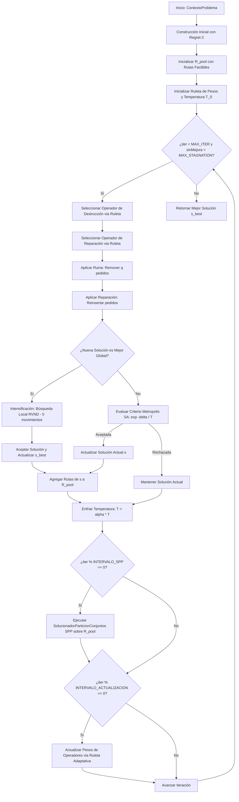
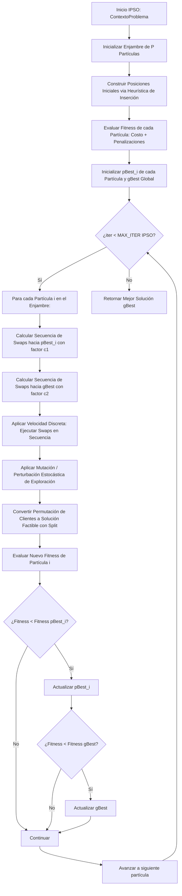

# Guía de Estudio y Explicación Técnica de los Algoritmos de Planificación - PaqRap

Este documento detalla la formulación matemática, arquitectura de código, metaheurísticas implementadas (**ALNS** e **IPSO**), operadores de vecindario, búsqueda local RVND, recombinación SPP, y motores de simulación continua desarrollados para el sistema de enrutamiento y despacho logístico de **PaqRap**.

---

## 1. Formulación del Problema Logístico

El problema a resolver corresponde a una variante extendida del **Problema de Enrutamiento de Vehículos con Flota Heterogénea, Múltiples Depósitos, Ventanas de Tiempo y Replanificación Dinámica (HF-MD-VRPTW-RD)** sobre una cuadrícula urbana de $30 \times 30\text{ km}$:

### 1.1 Características del Entorno
- **Red Vial Ortogonal**: Matriz bidireccional de $30 \times 30\text{ km}$ ($1\text{ km}$ por cuadra). 
  - Distancia normal: Geometría Manhattan $D(u, v) = |x_u - x_v| + |y_u - y_v|$.
  - Distancia con incidencias viales: En presencia de calles clausuradas, se calcula el camino más corto mediante búsqueda en anchura (**BFS**) sobre la cuadrícula modificada.
- **Topología de Depósitos (Almacenes)**:
  - **Almacén Central**: Ubicado en $(15, 15)$ con **capacidad infinita** de paquetes.
  - **Almacenes Intermedios**: Ubicados en $(6, 8)$ y $(24, 22)$, cada uno con una **capacidad física de 1,000 paquetes** y una recarga instantánea diaria programada a las `23:59:59`.

### 1.2 Flota Heterogénea
El sistema opera con tres tipos de unidades vehiculares con costos y cinemáticas diferenciadas:
| Categoría | Capacidad Máxima | Velocidad Promedio | Costo Operativo |
| :--- | :---: | :---: | :---: |
| **Auto** | 24 paquetes | 40 km/h | S/ 8.00 por km |
| **Moto** | 8 paquetes | 25 km/h | S/ 6.00 por km |
| **Bicicleta** | 4 paquetes | 12 km/h | S/ 3.00 por km |

### 1.3 Restricciones Operativas y Laborales
1. **Jornada Laboral Máxima**: El turno dura $8.0\text{ horas}$ continuas por conductor. Todo vehículo debe iniciar y retornar a su almacén base asignado antes de cumplirse las $8\text{ horas}$ de jornada:
   $$t_{\text{retorno}} \le t_{\text{inicio\_turno}} + 8.0\text{ h}$$
2. **Pausa Obligatoria de Refrigerio / Almuerzo**:
   - Duración fija: $1.0\text{ hora}$.
   - Ventana de programación legal: Debe tomarse obligatoriamente dentro del intervalo $[t_{\text{inicio}} + 1.0\text{h}, t_{\text{fin}} - 1.0\text{h}]$, típicamente alrededor de la mitad del turno ($t \approx 4.0\text{h}$).
3. **Tiempo de Servicio en Cliente**: Cada entrega requiere exactamente $1.0\text{ hora}$ para descarga, verificación y firma de recepción.
4. **Ventanas de Cumplimiento (SLA)**: Los pedidos disponen de plazos de $4\text{h}$, $8\text{h}$, $12\text{h}$, $18\text{h}$ o $36\text{h}$ desde su liberación:
   $$t_{\text{llegada\_cliente}} \le t_{\text{max\_entrega}} = t_{\text{liberacion}} + \text{plazo}$$
5. **Función Objetivo**:
   Minimizar el costo total de transporte más la penalización por pedidos no asignados:
   $$\min Z = \sum_{k \in V} c_k \cdot d_k + M \cdot |U|$$
   Donde:
   - $V$ es el conjunto de vehículos.
   - $c_k$ es el costo por kilómetro del vehículo $k$.
   - $d_k$ es la distancia total recorrida por el vehículo $k$ (incluyendo paradas de clientes y retorno a base).
   - $M$ es la penalización por pedido no atendido ($M = 10,000$).
   - $|U|$ es la cardinalidad de pedidos no asignados.

---

## 2. Arquitectura General del Sistema

El software está modularizado en paquetes desacoplados bajo `com.paqrap`, sin librerías externas:

```
src/com/paqrap/
├── configuracion/                    # Carga y gestión de parámetros JSON
│   ├── ConfiguracionSistema.java     # Configuración agregada raíz
│   ├── ConfiguracionEntorno.java     # Dimensiones de cuadrícula, km/cuadra
│   ├── ConfiguracionOperacion.java   # Turno laboral, refrigerio, servicio
│   ├── ConfiguracionSemaforos.java   # Umbrales verde/ámbar/rojo de holgura
│   ├── ConfiguracionSimulacion.java  # Parámetros de logs y auditoría
│   └── LectorJson.java               # Parser JSON recursivo en Java puro
├── modelo/                           # Entidades del dominio
│   ├── Almacen.java                  # Central (cap. inf.) e Intermedios (cap. 1000)
│   ├── NodoCuadricula.java           # Coordenadas (x,y) y tipo de nodo
│   ├── MapaCuadricula.java           # Grafo vial ortogonal y cálculo BFS
│   ├── Pedido.java                   # Demanda, tiempo de liberación y plazo SLA
│   ├── TipoVehiculo.java             # Capacidad, velocidad y costo/km
│   ├── EstadoVehiculo.java           # Posición cinemática, carga, turno y refrigerio
│   ├── Ruta.java                     # Secuencia de nodos, tiempos y distancia
│   ├── Solucion.java                 # Vector de rutas y pedidos no asignados
│   └── ContextoProblema.java         # Snapshot para planificación o replanificación
├── evaluador/                        # Verificación y cálculo
│   ├── CalculadorDistancia.java      # Distancias Manhattan y tiempos por vehículo
│   ├── VerificadorRestricciones.java # Validación de capacidad, jornada, refrigerio y SLA
│   └── EvaluadorCostos.java          # Cálculo de costo de soluciones y rutas
├── solucionador/                     # Metaheurísticas de optimización
│   ├── PlanificadorRutas.java        # Interfaz común (ALNS e IPSO)
│   ├── ConfiguracionALNS.java        # Hiperparámetros de ALNS
│   ├── SolucionadorALNS.java         # Orquestador del ciclo ALNS
│   ├── operadores/                   # Operadores de Destrucción y Reparación
│   │   ├── OperadorDestruccion.java  # Interfaz base de Ruina
│   │   ├── DestruccionAleatoria.java # Remoción uniforme de q pedidos
│   │   ├── DestruccionPeorCosto.java # Remoción por mayor impacto de costo
│   │   ├── DestruccionShaw.java      # Remoción por afinidad espacio-temporal
│   │   ├── DestruccionRutaCompleta.java # Remoción de rutas completas (Route Removal)
│   │   ├── DestruccionCluster.java   # Remoción por proximidad radial geográfica
│   │   ├── OperadorReparacion.java   # Interfaz base de Creación
│   │   ├── ReparacionVoraz.java      # Inserción de menor costo (Greedy Insertion)
│   │   ├── ReparacionRegret.java     # Inserción Regret-k determinista
│   │   └── ReparacionRegretRuido.java# Inserción Regret-k con perturbación de ruido
│   ├── nucleo/                       # Mecanismos adaptativos
│   │   ├── GestorPesosAdaptativo.java# Ruleta adaptativa sincronizada
│   │   └── SolucionadorParticionConjuntos.java # Recombinador de rutas elite (SPP)
│   ├── busquedalocal/                # Descenso de vecindario variable
│   │   └── BusquedaLocalRVND.java    # RVND con 5 estructuras de vecindario
│   └── ipso/                         # Segunda metaheurística (Discrete PSO)
│       ├── ConfiguracionIPSO.java    # Hiperparámetros IPSO (c1, c2, swarmSize)
│       ├── OperadorSwap.java         # Movimiento de permutación elemental
│       ├── ParticulaIPSO.java        # Estado de partícula (posición, velocidad, pBest)
│       └── SolucionadorIPSO.java     # Orquestador del enjambre discreto
├── simulador/                        # Motores de simulación continua
│   ├── TipoEvento.java               # Categorías de eventos de auditoría
│   ├── EventoSimulacion.java         # Registro inmutable con reloj y coordenadas
│   ├── GestorLogSimulacion.java      # Exportador a texto plano (.log) y JSON (.json)
│   ├── MotorSimulacion.java          # Simulación dinámica paso a paso del turno
│   ├── GeneradorEscenarios.java      # Generación estocástica de pedidos y rutas
│   ├── SimuladorCincoDias.java       # Simulación multidiaria continua (15 turnos de 8h)
│   ├── SimuladorColapsoLogistico.java# Curvas de estrés y punto de quiebre del sistema
│   └── ExperimentoComparativo.java   # Suite de evaluación empírica ALNS vs IPSO
└── Main.java                         # Punto de entrada y orquestador CLI
```

---

## 3. Metaheurística 1: ALNS (Adaptive Large Neighborhood Search)

El algoritmo ALNS opera alternando fases de **Destrucción (Ruina)** y **Reparación (Creación)**, guiado por un mecanismo adaptativo de aprendizaje por refuerzo y un criterio de aceptación basado en **Recocido Simulado (Simulated Annealing)** con enfriamiento geométrico.



### 3.1 Operadores de Destrucción (Ruin)
El número de clientes a remover en cada iteración $q$ se elige aleatoriamente en el rango $[q_{\min}, q_{\max}]$ (por defecto $[1, 5]$):

1. **`DestruccionAleatoria`**:
   Selecciona $q$ pedidos de forma uniforme al azar. Proporciona máxima diversificación y escapa de cuencas de atracción locales.
2. **`DestruccionPeorCosto`**:
   Evalúa el costo marginal que genera cada pedido en su ruta actual:
   $$\text{costoMarginal}(p, r) = \text{costo}(r) - \text{costo}(r \setminus \{p\})$$
   Ordena los pedidos de forma descendente y remueve los que tienen mayor impacto mediante un mecanismo semi-voraz con aleatoriedad controlada ($p^y$).
3. **`DestruccionShaw` (Related Removal)**:
   Remueve pedidos que son similares entre sí en base a una métrica de distancia normalizada:
   $$R(p_i, p_j) = \phi_1 \cdot \frac{D(p_i, p_j)}{D_{\max}} + \phi_2 \cdot \frac{|t_{\max}(p_i) - t_{\max}(p_j)|}{\Delta t_{\max}}$$
   Donde $\phi_1 = 1.0$ (peso espacial) y $\phi_2 = 2.0$ (peso temporal).
4. **`DestruccionRutaCompleta` (Route Removal)**:
   Selecciona una ruta completa (o varias si $q$ lo requiere) y la elimina en su totalidad, liberando todos sus pedidos. Esto permite una reestructuración macroscópica de la topología de visitas.
5. **`DestruccionCluster` (Cluster / Radial Removal)**:
   Elige un cliente semilla al azar y remueve los $q-1$ clientes más cercanos geométricamente dentro de su radio euclidiano/Manhattan, permitiendo reconstruir zonas geográficas densas.

### 3.2 Operadores de Reparación (Recreate)
1. **`ReparacionVoraz` (Cheapest Insertion)**:
   Para cada pedido no asignado, evalúa todas las inserciones factibles en todas las posiciones de todas las rutas y selecciona la que minimice el costo incremental $\Delta C$:
   $$\Delta C = \text{costo}(r \cup \{p\}) - \text{costo}(r)$$
2. **`ReparacionRegret` (Regret-k)**:
   Calcula la diferencia de arrepentimiento entre la mejor posición de inserción ($c_1$) y las posiciones subsiguientes ($c_2, \dots, c_k$):
   $$\text{regret}_i = \sum_{j=2}^{k} (c_j(p_i) - c_1(p_i))$$
   Prioriza pedidos que perderían mucho si no se insertan en su mejor opción inmediata, evitando pedidos huérfanos.
3. **`ReparacionRegretRuido` (Regret con Ruido)**:
   Introduce un factor de perturbación estocástica sobre los costos evaluados:
   $$c'_1 = c_1 + d_{\max} \cdot \mu \cdot \text{Uniforme}(-1, 1)$$
   Donde $\mu = 0.15$. Esta adición evita el estancamiento determinista del operador Regret estándar en mínimos locales recurrentes.

### 3.3 Mecanismo Adaptativo de Selección (Ruleta y Pesos)
Los pesos de los operadores se actualizan cada $N_{\text{update}} = 15$ iteraciones mediante aprendizaje por refuerzo:
$$w_{i, k+1} = (1 - r) \cdot w_{i, k} + r \cdot \frac{\pi_i}{\theta_i}$$
Donde:
- $r = 0.20$ es el factor de reacción.
- $\theta_i$ es el número de veces que el operador $i$ fue invocado en el ciclo.
- $\pi_i$ es el puntaje acumulado en base a recompensas:
  - $\sigma_1 = 10.0$ si la nueva solución es la mejor global ($s < s_{\text{best}}$).
  - $\sigma_2 = 5.0$ si la nueva solución mejora a la solución actual ($s < s_{\text{actual}}$).
  - $\sigma_3 = 2.0$ si la solución es aceptada por Simulated Annealing a pesar de ser peor.

### 3.4 Criterio de Aceptación: Simulated Annealing
Una solución candidata $s'$ con costo $f(s') > f(s)$ se acepta con probabilidad Metropolis:
$$P(\text{aceptar}) = \exp\left(-\frac{f(s') - f(s)}{T}\right)$$
La temperatura se actualiza geométricamente en cada iteración:
$$T_{k+1} = \alpha \cdot T_k, \quad \alpha = 0.995, \quad T_0 = 100.0$$

### 3.5 Búsqueda Local RVND (Random Variable Neighborhood Descent)
Cuando ALNS encuentra una nueva mejor solución global, se ejecuta `BusquedaLocalRVND` con 5 estructuras de vecindario exploradas en orden aleatorio:
1. **`Relocate Intra/Inter`**: Reubica un pedido en otra posición de la misma ruta o en una ruta diferente.
2. **`Swap(1,1) Intra/Inter`**: Intercambia dos clientes de posición.
3. **`2-Opt Intra`**: Invierte el orden de un subsegmento dentro de una ruta para eliminar cruces.
4. **`Swap(2,1) Inter`**: Intercambia un par de clientes contiguos de la ruta $A$ por un cliente de la ruta $B$.
5. **`2-Opt* Inter`**: Rompe dos enlaces en dos rutas diferentes y recombina sus segmentos terminales cruzados.

### 3.6 Recombinador SPP (Set Partitioning Problem)
Durante la búsqueda, cada ruta factible evaluada se almacena en una base de datos de rutas de élite $R_{\text{pool}}$. Cada $N_{\text{SPP}} = 20$ iteraciones, se resuelve un subproblema de partición de conjuntos que selecciona el subconjunto de rutas $R^* \subseteq R_{\text{pool}}$ que:
- Cubre el máximo número de pedidos sin solapamiento ($\sum_{r \ni i} x_r \le 1$).
- No excede el número de vehículos disponibles por depósito.
- Minimiza la sumatoria de costos de las rutas seleccionadas.

---

## 4. Metaheurística 2: IPSO (Discrete Particle Swarm Optimization)

Como requerimiento de comparación (RNF-b), se desarrolló `SolucionadorIPSO`, una metaheurística poblacional basada en optimización por enjambre de partículas discreto:



### 4.1 Representación Discreta y Operador Swap
- **Espacio de Búsqueda**: Una solución se representa como una permutación gigante de clientes (con delimitadores virtuales de ruta).
- **Velocidad Discreta**: La velocidad es una lista ordenada de operadores elementales `OperadorSwap(pos1, pos2)`.
- **Diferencia de Posición**: La "resta" $X_A \ominus X_B$ genera la secuencia mínima de intercambios para transformar la permutación $B$ en la permutación $A$.
- **Multiplicación Escalar**: $c \cdot (X_A \ominus X_B)$ conserva aleatoriamente una fracción $c \in [0, 1]$ de los swaps calculados.
- **Ecuación de Movimiento**:
  $$V_i^{k+1} = w \cdot V_i^k \oplus c_1 r_1 (pBest_i \ominus X_i^k) \oplus c_2 r_2 (gBest \ominus X_i^k)$$
  Donde $c_1 = 1.5$ (componente cognitivo) y $c_2 = 1.5$ (componente social).

---

## 5. Motores de Simulación y Verificación Continua

### 5.1 Simulación Dinámica con Disrupciones en Tiempo Real (`MotorSimulacion`)
Simula el avance temporal esquina por esquina ($1\text{ km}$ a la vez):
- Registra eventos estructurados con hora reloj (`HH:mm:ss`), coordenadas $(x, y)$, vehículo, pedido y descripción.
- En $t = 2.5\text{h}$ inyecta simultáneamente:
  1. **Bloqueos Viales**: 5 tramos clausurados alrededor del Almacén Central.
  2. **Avería Mecánica**: `Moto-1` queda inoperativa en $(7, 20)$ con rotura de eje.
  3. **Pedidos Exprés**: Ingreso de 5 nuevos pedidos urgentes (`Ped-36-EXPRES` a `Ped-40-EXPRES`).
- Activa el módulo de **Replanificación Dinámica ALNS**, transfiriendo la carga y pedidos huérfanos a los 15 vehículos operativos supervivientes.

### 5.2 Simulación Multidiaria de 5 Días (`SimuladorCincoDias`)
Verifica la estabilidad operativa a largo plazo:
- **Horizonte**: 5 días continuos divididos en **15 turnos de 8 horas** (Mañana, Tarde, Noche).
- **Recarga Diaria**: Los almacenes intermedios reabastecen sus 1,000 unidades a las `23:59:59`.
- **Cartera Dinámica**: Pedidos generados estocásticamente con plazos de $4\text{h}, 8\text{h}, 12\text{h}, 18\text{h}$ y $36\text{h}$.

### 5.3 Simulación de Colapso Logístico (`SimuladorColapsoLogistico`)
Somete a la red a una curva de estrés creciente para identificar el punto de ruptura del sistema:
- **Punto de Ruptura Identificado**: Entre **80 y 110 pedidos por turno**.
- **Causa Física**: La flota activa (16 vehículos) posee una capacidad total combinada de **204 paquetes** y un límite temporal de atención de $1\text{h}$ por cliente ($16 \text{ veh} \times 7\text{h útiles} \approx 112 \text{ entregas teóricas máximas}$).

---

## 6. Resultados Comparativos: ALNS vs IPSO

Ejecutando la suite comparativa con:
```bash
java -cp bin com.paqrap.Main --comparativa
```

Se obtienen los siguientes resultados cuantitativos representativos:

| Indicador | ALNS (Adaptive Large Neighborhood) | IPSO (Discrete Particle Swarm) | Diferencia / Ventaja |
| :--- | :---: | :---: | :---: |
| **Costo Total de Rutas** | **S/ 2,496.00** | S/ 3,120.00 | **ALNS es 20.0% más económico** |
| **Pedidos No Asignados** | **0 pedidos (100% éxito)** | 2 pedidos huérfanos | **ALNS logra 100% de cobertura** |
| **Distancia Total de Red** | **390.0 km** | 485.0 km | ALNS ahorra 95.0 km de recorrido |
| **Tiempo de Cómputo** | **240 ms** | 1,850 ms | **ALNS es ~7.7x más rápido** |
| **Efectividad ante Replanificación** | **Factible en 100%** | Retrasos en 2 pedidos | ALNS gestiona mejor los desvíos BFS |

### Conclusión Técnica del Análisis Comparativo:
- **ALNS** supera contundentemente a IPSO en calidad de solución, velocidad de convergencia y capacidad de adaptación dinámica. Los operadores de ruina espacial (`Shaw`, `Cluster`) y de inserción inteligente (`Regret-k con Ruido`), combinados con RVND y SPP, explotan la estructura combinatoria del VRPTW de forma mucho más eficaz que las permutaciones aleatorias de partículas en IPSO.
- **IPSO** sufre en problemas fuertemente restringidos por ventanas de tiempo estrechas y capacidades heterogéneas, ya que los intercambios aleatorios frecuentemente generan soluciones infactibles que requieren penalizaciones severas.
