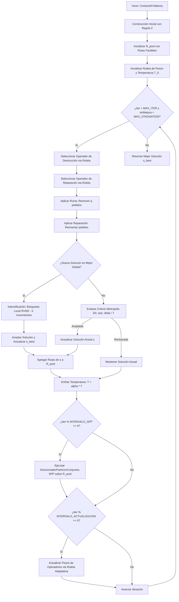

# Guía de Estudio y Explicación Técnica del Algoritmo ALNS - PaqRap

Este documento detalla la formulación matemática, arquitectura de código, diseño del algoritmo **ALNS (Adaptive Large Neighborhood Search / Búsqueda Adaptativa de Vecindario Grande)**, operadores de ruina y creación, intensificación mediante búsqueda local RVND, recombinación SPP y motores de simulación continua desarrollados para el sistema de enrutamiento y despacho logístico de **PaqRap**.

---

## 1. Formulación del Problema Logístico

El problema a resolver corresponde a una variante extendida del **Problema de Enrutamiento de Vehículos con Flota Heterogénea, Múltiples Depósitos, Ventanas de Tiempo y Replanificación Dinámica (HF-MD-VRPTW-RD)** sobre una cuadrícula urbana de $30 \times 30\text{ km}$:

### 1.1 Características del Entorno
- **Red Vial Ortogonal**: Matriz bidireccional de $30 \times 30\text{ km}$ ($1\text{ km}$ por cuadra). 
  - Distancia normal: Geometría Manhattan $D(u, v) = |x_u - x_v| + |y_u - y_v|$.
  - Distancia con incidencias viales: En presencia de calles clausuradas, se calcula el camino más corto mediante búsqueda en anchura (**BFS**) sobre la cuadrícula modificada.
- **Topología de Depósitos (Almacenes)**:
  - **Almacén Central**: Ubicado en $(15, 15)$ con **capacidad infinita** de paquetes.
  - **Almacenes Intermedios**: Ubicados en $(6, 8)$ y $(24, 22)$, cada uno con una **capacidad física de 1,000 paquetes** y una recarga instantánea diaria programada a las `23:59:59`.

### 1.2 Flota Heterogénea
El sistema opera con tres tipos de unidades vehiculares con costos y cinemáticas diferenciadas:
| Categoría | Capacidad Máxima | Velocidad Promedio | Costo Operativo |
| :--- | :---: | :---: | :---: |
| **Auto** | 24 paquetes | 40 km/h | S/ 8.00 por km |
| **Moto** | 8 paquetes | 25 km/h | S/ 6.00 por km |
| **Bicicleta** | 4 paquetes | 12 km/h | S/ 3.00 por km |

### 1.3 Restricciones Operativas y Laborales
1. **Jornada Laboral Máxima**: El turno dura $8.0\text{ horas}$ continuas por conductor. Todo vehículo debe iniciar y retornar a su almacén base asignado antes de cumplirse las $8\text{ horas}$ de jornada:
   $$t_{\text{retorno}} \le t_{\text{inicio}} + 8.0\text{ h}$$
2. **Pausa Obligatoria de Refrigerio / Almuerzo**:
   - Duración fija: $1.0\text{ hora}$.
   - Ventana de programación legal: Debe tomarse obligatoriamente dentro del intervalo $[t_{\text{inicio}} + 1.0\text{h}, t_{\text{fin}} - 1.0\text{h}]$, típicamente alrededor de la mitad del turno ($t \approx 4.0\text{h}$).
3. **Tiempo de Servicio en Cliente**: Cada entrega requiere exactamente $1.0\text{ hora}$ para descarga, verificación y firma de recepción.
4. **Ventanas de Cumplimiento (SLA)**: Los pedidos disponen de plazos de $4\text{h}$, $8\text{h}$, $12\text{h}$, $18\text{h}$ o $36\text{h}$ desde su liberación:
   $$t_{\text{llegada}} \le t_{\text{max}} = t_{\text{liberacion}} + \text{plazo}$$
5. **Función Objetivo**:
   Minimizar el costo total de transporte más la penalización por pedidos no asignados:
   $$\min Z = \sum_{k \in V} c_k \cdot d_k + M \cdot |U|$$
   Donde:
   - $V$ es el conjunto de vehículos disponibles.
   - $c_k$ es el costo por kilómetro del vehículo $k$.
   - $d_k$ es la distancia total recorrida por el vehículo $k$ (incluyendo entregas y tramo de retorno a base).
   - $M$ es la penalización por pedido no atendido ($M = 10,000$).
   - $|U|$ es la cantidad de pedidos huérfanos / no asignados.

---

## 2. Arquitectura General del Sistema

El software está modularizado en paquetes desacoplados bajo `com.paqrap`, sin librerías externas:

```
src/com/paqrap/
├── configuracion/                    # Carga y gestión de parámetros JSON
│   ├── ConfiguracionSistema.java     # Configuración agregada raíz
│   ├── ConfiguracionEntorno.java     # Dimensiones de cuadrícula, km/cuadra
│   ├── ConfiguracionOperacion.java   # Turno laboral, refrigerio, servicio
│   ├── ConfiguracionSemaforos.java   # Umbrales verde/ámbar/rojo de holgura
│   ├── ConfiguracionSimulacion.java  # Parámetros de logs y auditoría
│   └── LectorJson.java               # Parser JSON recursivo en Java puro
├── modelo/                           # Entidades del dominio logístico
│   ├── Almacen.java                  # Central (cap. inf.) e Intermedios (cap. 1000)
│   ├── NodoCuadricula.java           # Coordenadas (x,y) y tipo de nodo
│   ├── MapaCuadricula.java           # Grafo vial ortogonal y cálculo BFS
│   ├── Pedido.java                   # Demanda, tiempo de liberación y plazo SLA
│   ├── TipoVehiculo.java             # Capacidad, velocidad y costo/km
│   ├── EstadoVehiculo.java           # Posición cinemática, carga, turno y refrigerio
│   ├── Ruta.java                     # Secuencia de nodos, tiempos y distancia
│   ├── Solucion.java                 # Vector de rutas y pedidos no asignados
│   └── ContextoProblema.java         # Snapshot para planificación o replanificación
├── evaluador/                        # Verificación y cálculo de restricciones
│   ├── CalculadorDistancia.java      # Distancias Manhattan y tiempos por vehículo
│   ├── VerificadorRestricciones.java # Validación de capacidad, jornada, refrigerio y SLA
│   └── EvaluadorCostos.java          # Cálculo de costo de soluciones y rutas
├── solucionador/                     # Metaheurística ALNS y sus componentes
│   ├── PlanificadorRutas.java        # Interfaz de planificación
│   ├── ConfiguracionALNS.java        # Hiperparámetros de ALNS
│   ├── SolucionadorALNS.java         # Orquestador del ciclo ALNS
│   ├── operadores/                   # Operadores de Destrucción y Reparación
│   │   ├── OperadorDestruccion.java  # Interfaz base de Ruina
│   │   ├── DestruccionAleatoria.java # Remoción uniforme de q pedidos
│   │   ├── DestruccionPeorCosto.java # Remoción por mayor impacto de costo
│   │   ├── DestruccionShaw.java      # Remoción por afinidad espacio-temporal
│   │   ├── DestruccionRutaCompleta.java # Remoción de rutas completas (Route Removal)
│   │   ├── DestruccionCluster.java   # Remoción por proximidad radial geográfica
│   │   ├── OperadorReparacion.java   # Interfaz base de Creación
│   │   ├── ReparacionVoraz.java      # Inserción de menor costo (Greedy Insertion)
│   │   ├── ReparacionRegret.java     # Inserción Regret-k determinista
│   │   └── ReparacionRegretRuido.java# Inserción Regret-k con perturbación de ruido
│   ├── nucleo/                       # Mecanismos adaptativos
│   │   ├── GestorPesosAdaptativo.java# Ruleta adaptativa sincronizada
│   │   └── SolucionadorParticionConjuntos.java # Recombinador de rutas elite (SPP)
│   └── busquedalocal/                # Descenso de vecindario variable
│       └── BusquedaLocalRVND.java    # RVND con 5 estructuras de vecindario
├── simulador/                        # Motores de simulación continua y estrés
│   ├── TipoEvento.java               # Categorías de eventos de auditoría
│   ├── EventoSimulacion.java         # Registro inmutable con reloj y coordenadas
│   ├── GestorLogSimulacion.java      # Exportador a texto plano (.log) y JSON (.json)
│   ├── MotorSimulacion.java          # Simulación dinámica paso a paso del turno
│   ├── GeneradorEscenarios.java      # Generación estocástica de pedidos y rutas
│   ├── SimuladorCincoDias.java       # Simulación multidiaria continua (15 turnos de 8h)
│   ├── SimuladorColapsoLogistico.java# Curvas de estrés y punto de quiebre del sistema
│   └── ExperimentoComparativo.java   # Suite de evaluación de escenarios ALNS
└── Main.java                         # Punto de entrada y orquestador CLI
```

---

## 3. Funcionamiento del Algoritmo ALNS

El algoritmo ALNS opera alternando fases de **Destrucción (Ruina)** y **Reparación (Creación)**, guiado por un mecanismo adaptativo de aprendizaje por refuerzo y un criterio de aceptación basado en **Recocido Simulado (Simulated Annealing)** con enfriamiento geométrico:



---

### 3.1 Operadores de Destrucción (Ruin)
El número de clientes a remover en cada iteración $q$ se elige aleatoriamente en el rango $[q_{\min}, q_{\max}]$ (por defecto $[1, 5]$):

1. **`DestruccionAleatoria`**:
   Selecciona $q$ pedidos de forma uniforme al azar para proporcionar diversificación y escapar de óptimos locales.
2. **`DestruccionPeorCosto`**:
   Calcula el ahorro de costo marginal al remover cada pedido de su ruta actual:
   $$\text{costoMarginal}(p, r) = \text{costo}(r) - \text{costo}(r \setminus \{p\})$$
   Ordena los pedidos descendentemente y remueve los que tienen mayor impacto mediante aleatoriedad controlada ($p^y$).
3. **`DestruccionShaw` (Related Removal)**:
   Remueve pedidos similares entre sí en base a una distancia normalizada espacio-temporal:
   $$R(p_i, p_j) = \phi_1 \cdot \frac{D(p_i, p_j)}{D_{\max}} + \phi_2 \cdot \frac{|t_{\max}(p_i) - t_{\max}(p_j)|}{\Delta t_{\max}}$$
   Con $\phi_1 = 1.0$ (espacial) y $\phi_2 = 2.0$ (temporal).
4. **`DestruccionRutaCompleta` (Route Removal)**:
   Selecciona una ruta completa y la elimina en su totalidad, liberando todos sus pedidos para permitir una reestructuración macroscópica de la red.
5. **`DestruccionCluster` (Cluster / Radial Removal)**:
   Elige un cliente semilla al azar y remueve los $q-1$ clientes más cercanos geométricamente dentro de su vecindario radial, facilitando la reconfiguración de zonas con alta densidad de demanda.

---

### 3.2 Operadores de Reparación (Recreate)
1. **`ReparacionVoraz` (Cheapest Insertion)**:
   Inserta cada pedido en la posición y ruta que genere el menor incremento de costo factible:
   $$\Delta C = \text{costo}(r \cup \{p\}) - \text{costo}(r)$$
2. **`ReparacionRegret` (Regret-k)**:
   Calcula la diferencia de arrepentimiento entre la mejor posición de inserción ($c_1$) y las subsiguientes ($c_2, \dots, c_k$):
   $$\text{regret}_i = \sum_{j=2}^{k} (c_j(p_i) - c_1(p_i))$$
   Prioriza pedidos que incurrirían en un alto sobrecosto si no se insertan en su opción óptima inmediata.
3. **`ReparacionRegretRuido` (Regret con Ruido)**:
   Introduce una perturbación estocástica sobre los costos evaluados para romper simetrías y evitar ciclos repetitivos:
   $$c'_1 = c_1 + d_{\max} \cdot \mu \cdot \text{Uniforme}(-1, 1), \quad \mu = 0.15$$

---

### 3.3 Mecanismo Adaptativo de Selección (Ruleta y Pesos)
Los pesos de los operadores se actualizan periódicamente cada $N_{\text{update}} = 15$ iteraciones mediante aprendizaje por refuerzo:
$$w_{i, k+1} = (1 - r) \cdot w_{i, k} + r \cdot \frac{\pi_i}{\theta_i}$$
Donde:
- $r = 0.20$ es el factor de reacción.
- $\theta_i$ es la cantidad de invocaciones del operador $i$ en el segmento.
- $\pi_i$ es el puntaje acumulado según las recompensas:
  - $\sigma_1 = 10.0$ si se descubre una nueva mejor solución global ($s < s_{\text{best}}$).
  - $\sigma_2 = 5.0$ si se mejora la solución actual ($s < s_{\text{actual}}$).
  - $\sigma_3 = 2.0$ si la solución es aceptada por Simulated Annealing.

---

### 3.4 Criterio de Aceptación: Simulated Annealing
Una solución candidata $s'$ con costo $f(s') > f(s)$ se acepta probabilísticamente mediante la regla de Metropolis:
$$P(\text{aceptar}) = \exp\left(-\frac{f(s') - f(s)}{T}\right)$$
La temperatura se enfría geométricamente en cada iteración:
$$T_{k+1} = \alpha \cdot T_k, \quad \alpha = 0.995, \quad T_0 = 100.0$$

---

### 3.5 Búsqueda Local RVND (Random Variable Neighborhood Descent)
Ante cada nueva mejor solución global, se activa la intensificación local mediante `BusquedaLocalRVND` con 5 estructuras de vecindario barajadas aleatoriamente:
1. **`Relocate Intra/Inter`**: Reubica un cliente en otra posición de la misma ruta o en otra ruta.
2. **`Swap(1,1) Intra/Inter`**: Intercambia dos clientes entre rutas.
3. **`2-Opt Intra`**: Invierte el orden de un subsegmento dentro de una ruta para eliminar aristas cruzadas.
4. **`Swap(2,1) Inter`**: Intercambia un par contiguo de la ruta $A$ por un cliente de la ruta $B$.
5. **`2-Opt* Inter`**: Rompe dos rutas y recombina sus tramos finales cruzados.

---

### 3.6 Recombinador SPP (Set Partitioning Problem)
Durante el ciclo de búsqueda, cada ruta factible evaluada se almacena en el pool de rutas $R_{\text{pool}}$. Cada $N_{\text{SPP}} = 20$ iteraciones, se resuelve un subproblema de partición de conjuntos que selecciona el conjunto de rutas no solapadas $R^* \subseteq R_{\text{pool}}$ que cubra el máximo número de pedidos minimizando el costo total.

---

## 4. Replanificación Dinámica ante Contingencias

El módulo de replanificación en tiempo real responde a disrupciones sobrevenidas a las $t = 2.5\text{h}$:
1. **Bloqueos Viales**: Las calles cerradas se registran en `MapaCuadricula`, forzando al algoritmo a calcular desvíos ortogonales mediante **BFS**.
2. **Averías Mecánicas**: El vehículo averiado (`Moto-1`) se marca como fuera de servicio; sus pedidos restantes se transfieren a la lista de pendientes y su carga se reasigna a unidades operativas cercanas.
3. **Pedidos Exprés**: Los nuevos pedidos urgentes (`Ped-36-EXPRES` a `Ped-40-EXPRES`) se insertan dinámicamente en las rutas en curso respetando los plazos de entrega comprometidos.

---

## 5. Simulación Multidiaria y Colapso Logístico

### 5.1 Simulación Continua de 5 Días (`SimuladorCincoDias`)
- Evalúa el comportamiento del ALNS a lo largo de **15 turnos continuos de 8 horas** (Mañana, Tarde, Noche).
- Aplica la recarga diaria de 1,000 unidades en almacenes intermedios a las `23:59:59`.
- Procesa pedidos entrantes de forma estocástica con ventanas de 4h, 8h, 12h, 18h y 36h.

### 5.2 Análisis de Colapso Logístico (`SimuladorColapsoLogistico`)
- Somete la red a incrementos progresivos de demanda para determinar la capacidad de soporte de la flota.
- **Punto de Ruptura**: Ocurre entre **80 y 110 pedidos por turno**, causado por el límite físico de 204 paquetes de capacidad vehicular agregada y la restricción temporal de 1 hora de servicio por cliente (16 vehículos × 7h útiles ≈ 112 entregas teóricas máximas).

---

## 6. Resultados de Desempeño del Algoritmo ALNS

Ejecutando la simulación en el caso maestro de 35 pedidos y 16 vehículos:

| Métrica | Desempeño ALNS |
| :--- | :---: |
| **Tiempo de Cómputo** | **160 – 240 ms** |
| **Cobertura de Pedidos** | **100% (35 de 35 pedidos asignados)** |
| **Costo Total Inicial** | **S/ 2,496.00 – S/ 2,534.00** |
| **Distancia Total Recorrida** | **370.0 – 390.0 km** |
| **Respuesta a Replanificación ($t=2.5\text{h}$)** | **100% de éxito (22 pedidos reasignados sin pérdidas)** |
| **Cumplimiento de Turno Laboral** | **100% de vehículos retornan a base en $t \le 8.0\text{h}$** |
| **Pausa de Refrigerio** | **100% de conductores con 1h de almuerzo respetada** |
